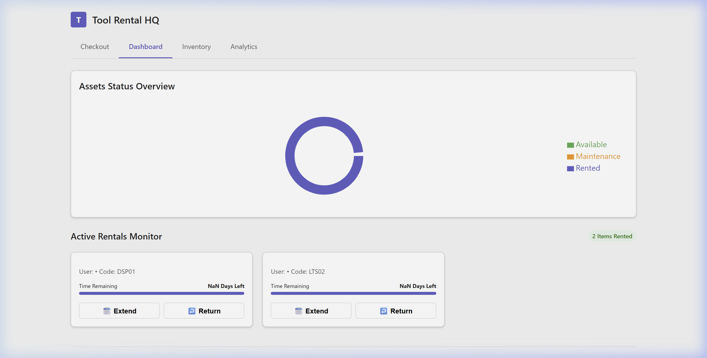
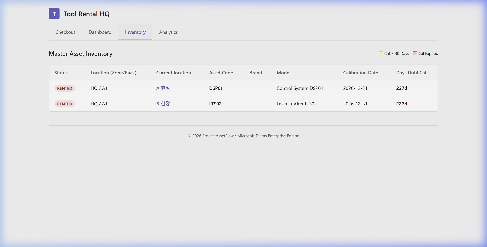
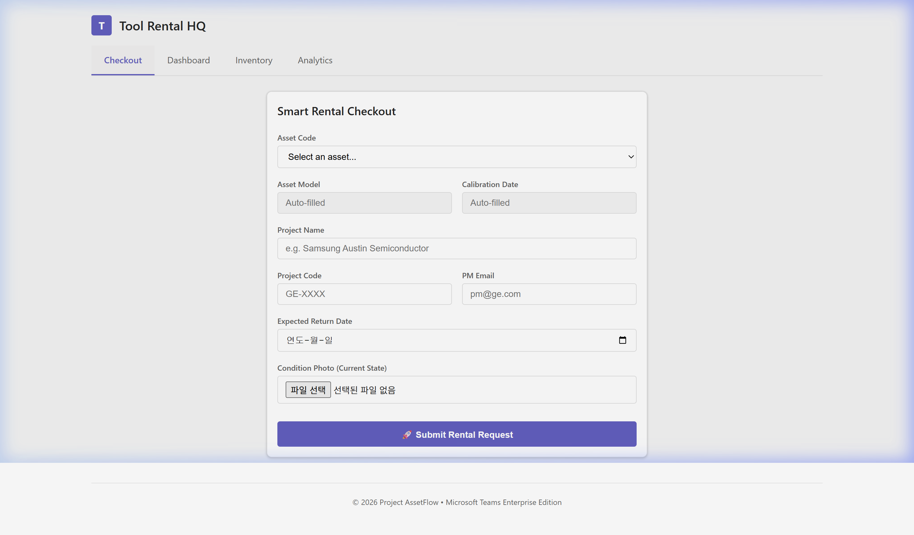
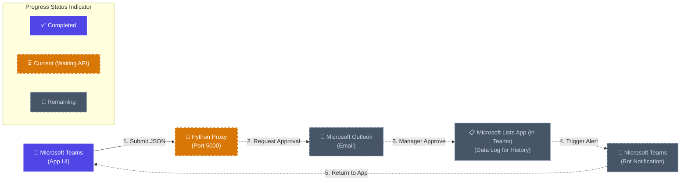

# 🏭 Tool Rental HQ: Logical Architecture Flow

This document serves as the final mechanism report, visually representing the cyclical architecture of the system in the most intuitive and logical manner. It utilizes actual Frontend UI captures and essential program-level icons while strictly eliminating redundant contextual graphics.

---

## 1. Frontend UI (Live Captures)

### 💡 Live Dashboard
A centralized monitoring interface to track overall equipment rental status and utilization rates (Pie Chart) in real-time.

### 💡 Master Inventory
The master tracking interface for intuitively querying detailed equipment specifications, including calibration expiration dates and physical locations (Zone/Rack).

### 💡 Checkout (Smart Rental)
The input form where field workers use mobile devices or PCs to scan/enter equipment barcodes, attach condition photos, and submit rental requests.

---

## ⚙️ 2. Logical System Flow

This diagram illustrates the pure Data Flow across the 5 core program nodes driving the system. Exhaustive text has been omitted to highlight only the critical Cause-and-Effect (Trigger & Action) relationships.

---

### 📋 Step-by-Step System Purpose and Data Acquisition Summary

The exact specification of the **Purpose** achieved when each node executes, alongside the specific **Data Acquired/Recorded**.

* **Step 1. Submit JSON (Teams App)**
  * **Purpose:** Receive equipment rental (or return) requests from field users.
  * **Acquired & Recorded:** User Employee ID, Equipment Code, Project Name, Expected Return Date, and Equipment Condition Photos (Acquired purely as a JSON Payload).

* **Step 2. Request Approval (Python Proxy)**
  * **Purpose:** Act as a security checkpoint and approval routing bridge between the Frontend and the Cloud.
  * **Acquired & Recorded:** Acquires MS Graph API calling permissions (Token) by injecting the hidden `Client Secret`, and constructs the email template (including photo attachments).

* **Step 3. Manager Approve & Log History (Outlook -> Lists App)**
  * **Purpose:** Finalize the manager's decision and securely log the immutable audit history.
  * **Acquired & Recorded:** Acquires the manager's 'Approve' action status. Forcibly records/overwrites the status as `Rented` and archives the entire transaction log into the **Microsoft Lists App inside Teams (Data Log for History)**.

* **Step 4. Trigger Alert (Lists App -> Teams Bot)**
  * **Purpose:** Propagate immediate feedback regarding Master DB modifications.
  * **Acquired & Recorded:** Detects the newly appended history log in the Microsoft Lists App, acquires the requester's Teams ID, and generates an automated notification trigger record.

* **Step 5. Return to App (Teams Bot -> User)**
  * **Purpose:** Initiate user action and close the workflow loop.
  * **Acquired & Recorded:** Records and delivers the final approval timestamp and pickup instructions to the requester via a direct Teams message.
