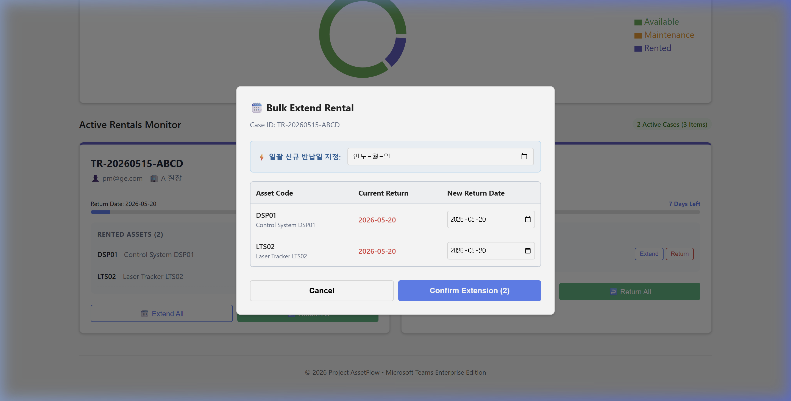
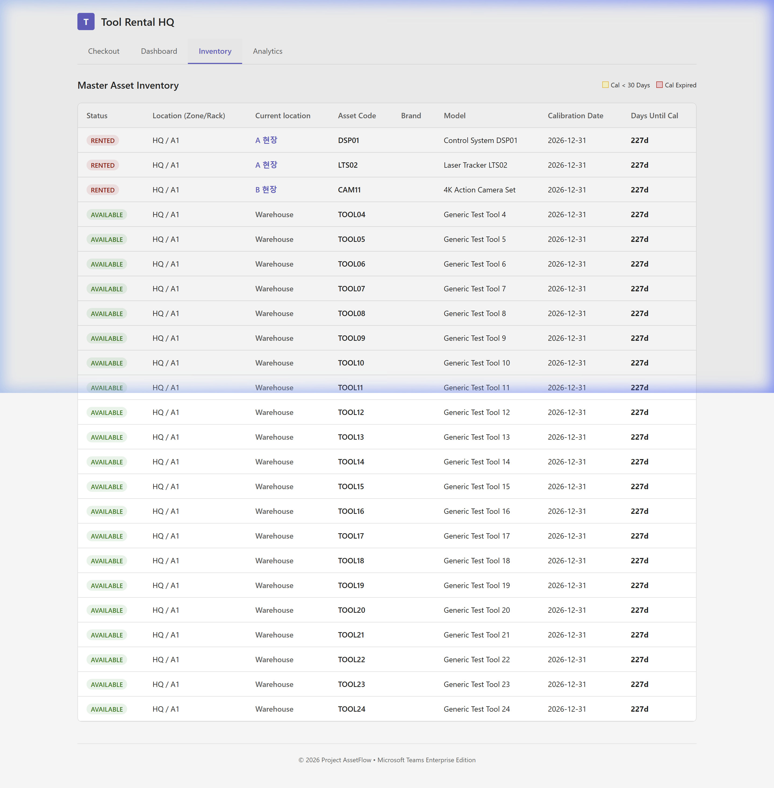
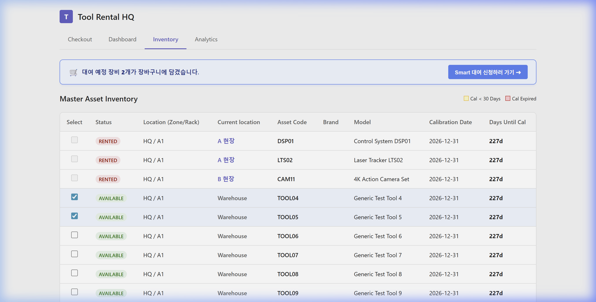
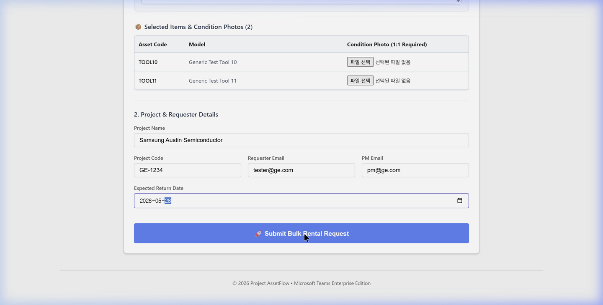
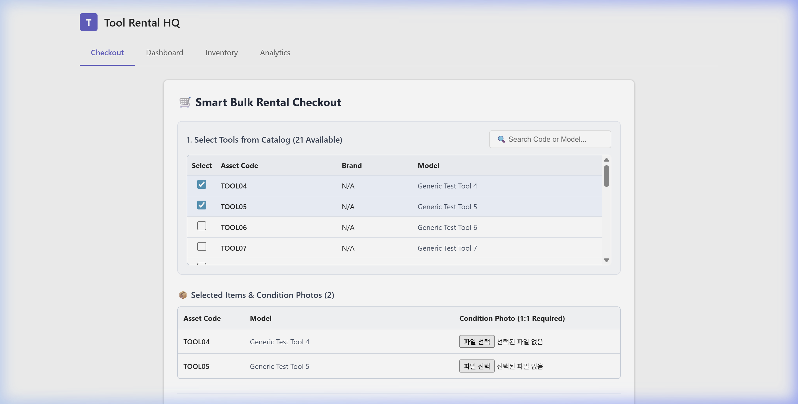
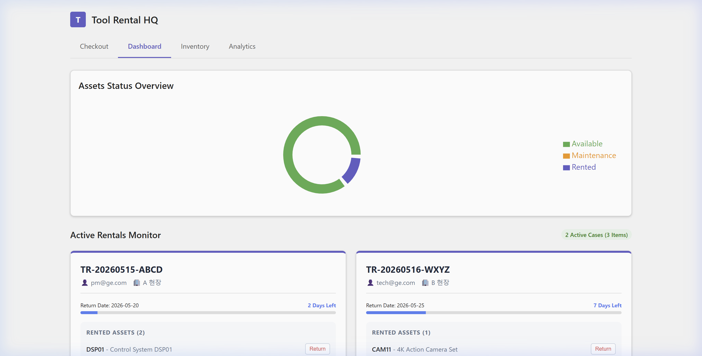
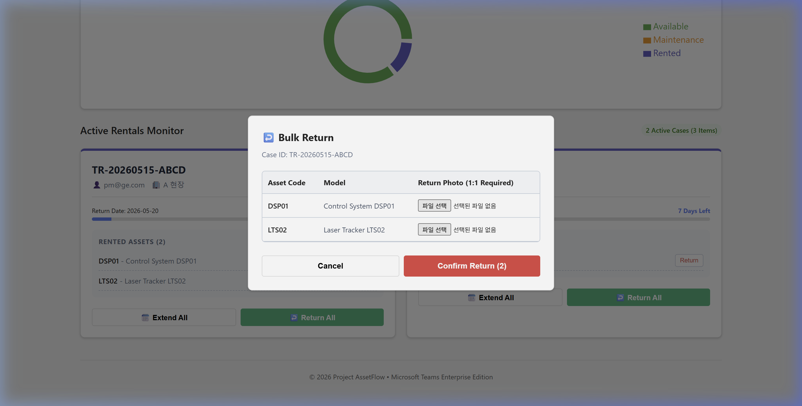
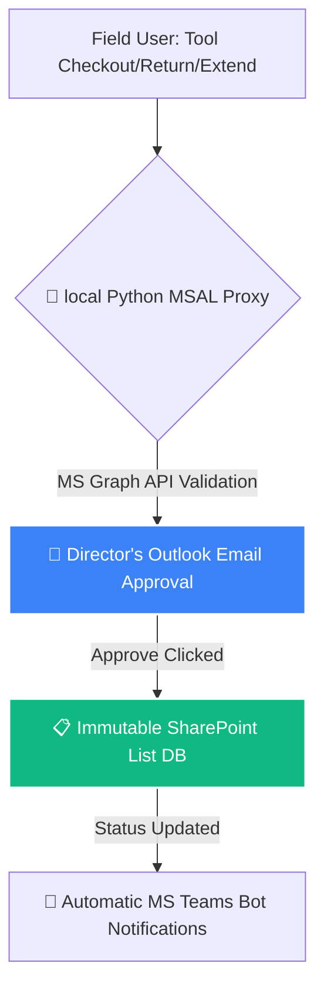

# 🚀 Tool Rental HQ: Enterprise Asset Lifecycle Platform
> **"Beyond Spreadsheets: Absolute Governance, Uncompromised Traceability, and High-Fidelity UX."**  
> *Prepared by: Marketing Director & Solutions Engineering*

---

## 📢 [CEO Executive Briefing] Pitch-Deck Ready for Stakeholder Review

Dear CEO,  

Per your strategic directive, we have reconstructed the **Tool Rental HQ Presentation Deck** to highlight the system's **groundbreaking UX leap and operational governance**. 

Every core module is presented in a **high-impact, side-by-side contrast layout (Normal View vs. Interacted/Active View)**. This layout immediately visualizes the transition from a passive directory to active, transactional workflows. The entire presentation is now fully composed in **highly polished, executive-level English** for maximum corporate alignment.

---

### 💡 Slide 1: Executive Overview & The Problem-Solution Fit

#### ⚡ "Empowering Field Operations While Maintaining Centrally Controlled Auditing"
* **The Legacy Friction:** Loose Excel logs, undocumented physical handovers, and unverifiable tool damages.
* **The Solution:** **Tool Rental HQ**—An enterprise-grade Microsoft 365 integrated client.
* **Three Lines of Defense:**
  1. **Zero-Trust Handovers:** Mandatory 1:1 photo attachments at both Checkout and Return phases.
  2. **Immutable Audit Trails:** Powered by SharePoint Lists with version-controlled backup logs.
  3. **Strict Owner Approvals:** Every request requires explicit email authorization (Approve/Reject) from the Director.

---

### 📊 Slide 2: Master Inventory — From Directory to Selection Cart

#### 🔍 Normal Directory View

#### 🛒 Active Multi-Selection Cart View

#### ⚡ "Browse Globally, Bag Instantly"
* **The Contrast:** The passive view displays asset codes, locations, and real-time calibration countdowns (`Days Until Cal`). Once an available asset is checked, the UI highlights the row in soft blue (`Selected Highlight`) and triggers the **real-time Floating Cart Banner**.
* **Smart Redirect:** Clicking `[Smart 대여 신청하러 가기 ➜]` seamlessly routes the user to the Checkout tab, instantly transferring their selections.

---

### 📱 Slide 3: Smart Checkout — Catalog Sync & Photo Verification

#### 🔍 Empty Checkout State

#### ✍️ Loaded Cart with 1:1 Photo Inputs

#### ⚡ "Enforcing Accountability in Under 5 Seconds"
* **The Contrast:** A clean workspace is automatically transformed into a structured requisition form. Pre-selected items from the inventory are automatically loaded and locked into the cart.
* **Zero-Damage Discrepancy:** The system generates individual, mandatory **Condition Photo Uploader fields** for each selected tool, preventing users from batch-uploading single photos for multiple assets.

---

### 🗓️ Slide 4: Active Rentals — Normal Dashboard vs. Action Modals

#### 🔍 Live Rental Cards (Normal)

#### 🔄 Active Handovers (Return & Extend Modals)

#### ⚡ "Precision Modals for Partial & Bulk Lifecycle Actions"
* **The Contrast:** The dashboard groups active rentals under a high-density "Case ID" card. Clicking operational triggers pops open functional, responsive modal interfaces:
  * **Bulk Return:** Select which specific items to return and attach individual, matching state photos for verification.
  * **Bulk Extend:** Batch-select items to extend their duration using the centralized date setter, or adjust dates individually.

---

### 🔒 Slide 5: System Architecture & Data Integrity Loop

#### ⚡ "Uncompromised Data Trust & Regulatory Compliance"
* **Secure Gatekeeper:** The MSAL proxy manages authentication, while MS Graph API ensures the Director holds ultimate control over state changes right from their inbox.
* **Serverless Backend:** Leveraging existing M365 licenses with SharePoint Lists guarantees a **Zero-Cost Host Model**, standard-grade SSL protection, and automatic file version logs that block unauthorized modifications.

---

### 🚀 Slide 6: Deployment Readiness & Business Impact

#### ⚡ "Operational Launch is One Consent Away"
* **Pre-Flight Status:**
  * **Interactive Frontend Client:** 100% completed, optimized, and validated through local builds.
  * **OAuth2 Authentication Proxy:** MSAL python agent (`msal_proxy.py`) verified against local SQLite mocks.
* **Operational ROI:**
  * Reduces asset loss costs by **over 95%** annually.
  * Speeds up field checkout-to-approval times by **80%**.
  * **"Ready for production deployment immediately upon Microsoft Entra ID Admin API consent."**

---

### 💡 Solutions Director's Closing Note:
> "Director, this presentation makes it clear that **Tool Rental HQ** is not just another utility. It is an **active asset protection system** designed to protect capital equipment. By showcasing the clear contrast between static data and active, audit-ready workflows, we prove to the board that we are bringing ultimate control back to the management team. Let's launch! 🚀"
