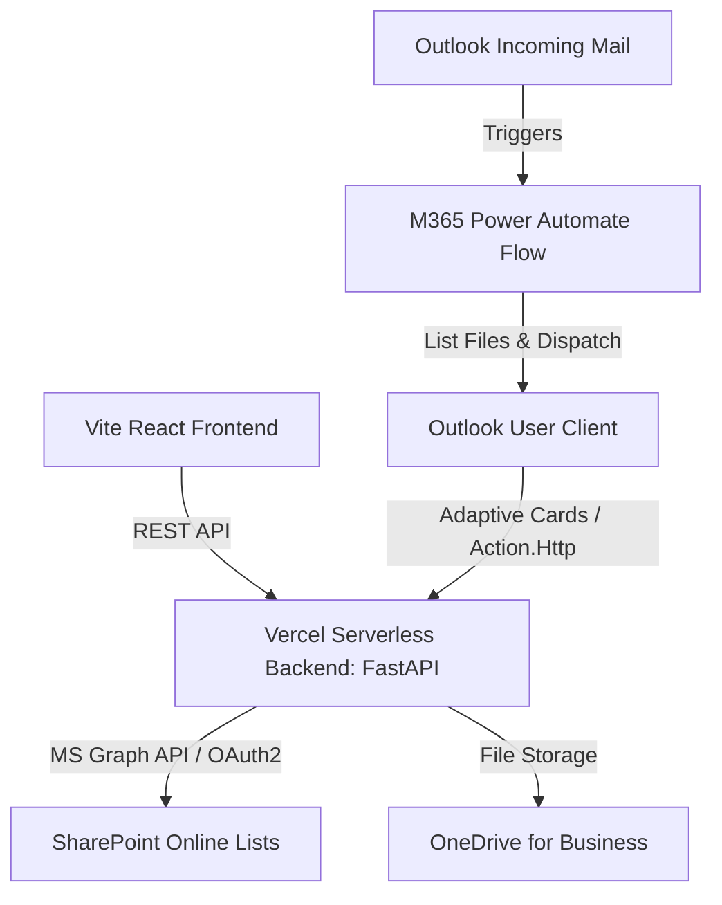

# Tool Automate System - Technical Specification

본 문서는 사내 PC의 AI가 본 시스템(Tool Rental Scheduler 및 M365 자동화 시스템)을 원격 서버나 로컬 개발 환경에 **정확히 동일하게 구현 및 배포**할 수 있도록 코드베이스 구조, 핵심 업그레이드 내역, 그리고 사내 인프라 연동 방식을 정리한 종합 사양서(Specification)입니다.

---

## 1. 시스템 아키텍처 개요 (System Architecture)

본 시스템은 **클라이언트-서버-SaaS 백엔드** 구조를 취하고 있으며, 무중단 서버리스 배포에 최적화되어 있습니다.



1. **프론트엔드 (React + Vite + TypeScript)**: Vercel에 정적 빌드 및 배포되며, TailwindCSS v4 표준 CSS 변수를 따르는 GEV 디자인 시스템을 준수합니다.
2. **백엔드 (Python FastAPI)**: Vercel Serverless Functions로 작동하며, SharePoint API 연동 모크 모드 및 실서버 모드를 선택하여 지원합니다.
3. **M365 연동 (Power Automate + Outlook)**: 사용자가 브라우저 창을 열지 않고 아웃룩 메일 내 체크박스 조작만으로 자료 요청 및 검교정 서류 첨부 처리를 자동으로 수행합니다.

---

## 2. 폴더 및 파일 구조 (Folder Structure)

본 프로젝트는 다음과 같은 구조를 유지하며, 프론트엔드의 모든 핵심 컴포넌트는 **1개 컴포넌트 = 4개 파일** 규칙을 강제 준수합니다.

```
02_Workspace/Tool_Rental_HQ/
├── package.json               # Vite + React + Tailwind + Vitest 설정
├── tsconfig.json              # TypeScript 정적 타입 컴파일 규칙
├── vercel.json                # Vercel Serverless Routing 및 API 경로 설정
├── vite.config.ts             # Vite 빌드 및 Vitest 환경 구성
├── install.ps1 / install.sh   # 로컬 Git pre-commit 훅 자동 등록 스크립트
├── api/
│   └── index.py               # 백엔드 핵심 소스 (FastAPI, SharePoint API, 검교정 파일 처리)
├── docs/
│   ├── 00_Gemma_Rules.md      # 로컬 AI 추론 규칙 가이드
│   ├── DESIGN.md              # GEV 디자인 가이드라인
│   └── WALKTHROUGH.md         # 컴포넌트 리팩토링 및 릴리즈 노트
├── scripts/
│   ├── check_tokens.mjs       # Git hook용 하드코딩 컬러/여백 체크 스크립트
│   └── design_audit.mjs       # 컴포넌트 1:4 구조 유효성 검사기
└── src/
    ├── App.tsx                # 프론트엔드 메인 라우터 및 상태 관리
    ├── index.css              # GEV 글로벌 CSS 토큰 정의 및 Tailwind 바인딩
    ├── types.ts               # 장비(Tool), 스케줄(Schedule) 인터페이스 타입 정의
    └── components/            # 핵심 컴포넌트 폴더 (1 Component = 4 Files 규칙 준수)
        ├── ActiveRentals/     # 대여 장비 카드 목록
        ├── AnalyticsTab/      # 자원 가동률 차트 및 통계
        ├── InventoryTable/    # 전체 장비 카탈로그 테이블 및 대여 신청 폼 바인딩
        └── SchedulingTab/     # 캘린더/칸반 보드 예약 스케줄러 (검색, 벌크 액션, 검교정 확인)
```

---

## 3. 핵심 기능 구현 & 최근 업그레이드 내역

최근 헤비서(Codex Remote Daemon)를 통해 업그레이드되어 배포된 핵심 기능 상세 내역입니다:

### 3.1 원자적 Case ID 그룹화 (Atomic Case ID Grouping)
* **기존 문제**: 한 번에 여러 장비(예: 멀티미터, 클램프미터)를 대여 신청할 때, 각 장비마다 개별적인 Case ID가 생성되어 스케줄 대시보드상에서 카드가 파편화되는 현상이 발생함.
* **해결 방안**: Bulk Rental API(`/api/sharepoint/rental`) 호출 시 단일 `caseId` 아래에 모든 대여 대상 장비를 원자적(Atomic)으로 바인딩합니다. 백엔드는 이를 하나의 `Case` 단위로 결합하여 관리하고, 프론트엔드는 카드 렌더링 시 Case ID를 기준으로 그룹화하여 대시보드 밀집도를 해소합니다.

### 3.2 스케줄러 일괄 처리 (Bulk Selection & Search Indexing)
* **일괄 선택 최적화**: 스케줄 탭의 일괄 선택 기능이 고도화되어, 검색 필터에 걸려 있는 대상 장비들만 동적으로 **"Select All" / "Deselect All"** 버튼을 통해 다중 제어할 수 있습니다.
* **키워드 및 상태 인덱싱**: 검색창에 `Pending`, `In_Progress` 등 상태 키워드나 `Case ID` 번호를 입력하면 해당 장비 목록만 즉각 필터링되며, 필터링된 대상을 한꺼번에 `Approve Selected` 버튼으로 일괄 승인 처리할 수 있습니다.

### 3.3 Expected Lineup 시각적 액티브 강조
* **In_Progress 강조**: 예상 대여 라인업 테이블(`Expected Lineup`) 중 현재 시각 기준 대여 진행 중(`In_Progress`)인 건들을 시각적으로 강조합니다.
* **디자인 토큰 바인딩**:
  * 배경색: 청록색 연한 톤 (`var(--f-primary-light)`)
  * 폰트: **Bold** 스타일
  * 경계선: 왼쪽 테두리 3px 액센트 선 (`3px solid var(--f-primary)`)

---

## 4. 백엔드 REST API 명세 (FastAPI)

백엔드인 `/api/index.py`는 Vercel Serverless Functions 환경에서 구동되며 다음 핵심 API 엔드포인트를 제공합니다.

### 1) 장비 카탈로그 조회 (`GET /api/sharepoint/list`)
SharePoint Lists와 연동되어 장비 전체 목록 및 상태를 반환합니다.

### 2) 일괄 대여 신청 (`POST /api/sharepoint/rental`)
* **Request Body Schema**:
  ```json
  {
    "caseId": "TR-20260613-0001",
    "items": [{"toolCode": "CCP01"}, {"toolCode": "CCP02"}],
    "projectName": "Project Site A",
    "returnDate": "2026-06-30",
    "pmEmail": "pm@ge.com",
    "userEmail": "pm@ge.com"
  }
  ```
* **동작**: 입력된 장비 목록에 단일 `caseId`를 바인딩하고 대여 스케줄 상의 상태를 `Pending_Approval`로 등록합니다.

### 3) 일괄 대여 승인 (`POST /api/sharepoint/schedule/approve-bulk`)
* **Request Body Schema**: `["SCH-202606-0001", "SCH-202606-0002"]` (스케줄 ID 배열)
* **동작**: 선택된 스케줄 카드의 상태를 `In_Progress`로 일괄 업데이트하며, 해당 장비들의 상태를 `Rented`로 동기화합니다.

### 4) 검교정 상태 완료 처리 (`POST /api/sharepoint/calibration/clear`)
* **Request Format**: Multipart Form-data
* **Parameters**: `schedule_id`, `calibration_date`, `pdf_file` (파일), `image_file` (파일)
* **동작**:
  * 장비의 검교정 완료 데이터를 업데이트합니다.
  * 제출된 검교정 PDF 성적서와 확인 사진을 지정된 OneDrive 폴더(`C:\Users\cfpcl\OneDrive\Calibration_Reports`)에 규격 명명 템플릿(`검교정날짜_툴코드_모델명_시리얼넘버.pdf`)에 맞추어 자동 저장합니다.
  * 해당 스케줄 카드를 `Completed` 상태로 전환하고, 장비는 다시 `Available`로 복원시킵니다.

---

## 5. 사내 PC 구현 및 환경 설정 가이드

사내 PC의 AI가 본 환경을 완벽하게 재구성하기 위해 설정해야 할 인프라 세부 단계입니다.

### 5.1 로컬 개발 서버 구동 및 검증
1. **의존성 패키지 설치**:
   ```bash
   npm install
   pip install -r requirements.txt
   ```
2. **로컬 실행**:
   * 프론트엔드: `npm run dev`
   * 백엔드: `uvicorn api.index:app --reload --port 8000` (Vite Proxy 설정 적용됨)
3. **통합 테스트 및 빌드 검증**:
   * 단위 테스트 실행: `npx vitest run` (18개 테스트 전체 통과 확인)
   * 프로덕션 빌드: `npm run build` (정적 파일 및 Vercel 라우팅 아티팩트 빌드 성공 확인)

### 5.2 Git pre-commit 디자인 감사 훅 복제
사내 개발자가 스타일 코드를 작성할 때 하드코딩 색상(`hex`, `rgb`, `named color`)을 사용하거나 파일 4개 규칙을 어기는 일을 방지하기 위해 로컬 Git 훅을 가동합니다.
* 사내 PC AI는 복제한 `install.ps1` 또는 `install.sh` 스크립트를 관리자 권한 터미널에서 실행하여 `.git/hooks/pre-commit`에 훅을 강제 복사해 설치해야 합니다.

### 5.3 M365 Power Automate 및 아웃룩 연동 구현
1. **흐름 1 (백엔드 처리기)**:
   * Power Automate에서 `HTTP 요청이 수신되는 경우` 트리거를 사용하고 본 사양서의 4번 API 스키마를 따르는 흐름을 구성합니다.
   * 전달된 파일 리스트를 콤마 기준으로 쪼개어 OneDrive `/admin_shared_docs/` 경로 내 파일을 가져온 뒤, `이메일 보내기(V2)` 액션에 파일 콘텐츠 배열을 매핑하여 이메일 첨부파일로 발송합니다.
2. **흐름 2 (포탈 발송기)**:
   * `#자료요청` 이메일이 들어오면 작동하며, OneDrive의 특정 행정 폴더 내 파일 리스트를 `데이터 작업 - Select`로 스캔해 적응형 카드(Adaptive Cards) ChoiceSet에 매핑해 1차 발신합니다.
   * 아웃룩 개발자 포털(`outlook.office.com/connectors/publish`)에 발신자 주소를 등록하여 조직(Organization) 또는 테스트 유저 범위에서 카드가 메일창 내부에서 렌더링되고 백엔드로 제출될 수 있도록 보안 권한을 승인합니다.
